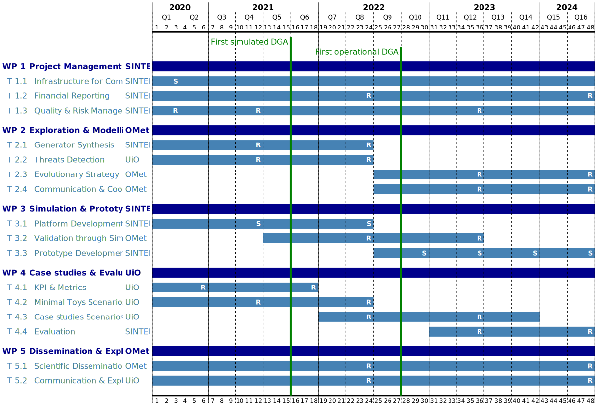

# The EPIC Project

We detail below a project we used to illustrate the use of RPP. It
includes a workplan and team specification.

## Work Plan

The [EPIC work plan][workplan] is divided into five work packages,
which are sub-divided into tasks. Overall, the project runs over 48
months and includes two milestones.

## The Team

The [EPIC team][team] gathers three teams of people, one bigger team
with three persons, and two one-person teams.

## Sanity checks

The EPIC descriptions are both valid and their verification do not
reveal any issue or warning.

```shell-session
$ rpp verify -p workplan.yaml -t team.yaml
0 warning(s), 0 issue(s).
```

## The Gantt Chart

Generating a Gantt chart with both workplan and team yields the
following:

```shell-session
$ rpp gantt -p workplan.yaml -t team.yaml -o gantt.svg
```




[workplan]: https://raw.githubusercontent.com/fchauvel/rpp/docs/samples/epic/workplan.yaml

[team]: https://raw.githubusercontent.com/fchauvel/rpp/docs/samples/epic/team.yaml
