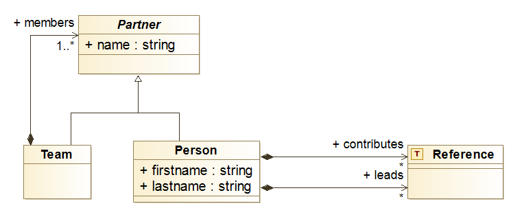

# Teams

RPP also accepts a description of the team that is taking on the
work plan. The team is simply a hierarchy of persons specified in a
separate YAML or a JSON file.

## A Simple Example

Let's take a look at the team defined for the [EPIC
project](samples/epic), which we show below. We however refer you to
the [team data schema][team-schema] for a comprehensive specification. Here we have specified three teams, the first one includes three persons, whereas the two others only one.

```yaml
team:
  name: EPIC
  members:
  - name: SINTEF
    members:
      - firstname: Franck
        lastname: Chauvel
        leads: [ WP1, T1.1, T1.2, T3.1, T4.4 ]
      - firstname: Brice
        lastname: Morin
        leads: [ WP3, T2.1, T3.3 ]
      - firstname: Ketil
        lastname: Stølen
        leads: [ T1.3 ]
  - name: UiO
    members:
      - firstname: Olaf
        lastname: Owe
        leads: [ WP4, T2.2, T4.1, T4.2, T4.3, T5.2]
  - name: OMet
    members:
      - firstname: Stephano
        lastname: Nichele
        leads: [ WP2, WP5, T2.3, T3.2, T2.4, T5.1 ]
```

<note>

The reference to the work plan, used to specific the
responsibilities a person may take in project must adhere to the
pattern `/(\d+)/`. For instance `WP 1`, `T 1.2.3` or `A 1.2`.

</note>

## Detailed Structure

The following class diagram summarizes the structure of teams, as they
specified in either JSON or YAML.

</img>

A team description includes:

-   Its name,  as  a string (field `name`)

-   The list of its members (field `members`), either other teams or
    persons, where:

    -   A person description includes

        -   Its firstname (field `firstname`) as a string

        -   Its lastname (field `lastname`) as a string

        -   The list of activities (from the work plan) where she
            contributes (field `contributes`)

        -   The list of activities (from the work plan) that she leads
            (field `leads`)

[team-schema]: https://github.com/fchauvel/rpp/blob/058f1722d116955bb9a018dcca6287a926044670/src/storage/adapters/schemas.ts#L111
