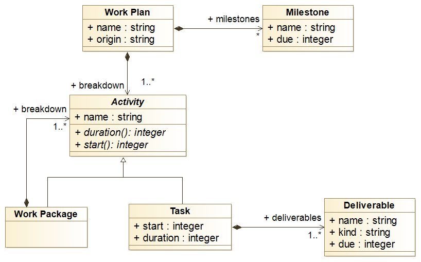

# The Work Plan

When we use RPP, we describe the workplan (i.e., the work breakdown
structure) in a text file (either a JSON or YAML file). The actual
schema is the same for both JSON and YAML file.

<note type="tip">
RPP accepts either JSON or YAML files. We recommend YAML however,
because we find it more user friendly, but also because it let us put
comments. That's pretty handy to temporarily dismiss a few elements
</note>

## A Simple Example

Here we describe a dummy workplan in YAML made of one task and one
workpackage. We also defined two dummy milestones, one every 8
months. We have highlighted every task definition. We refer you to the
[work plan data schema][workplan-schema] for a comprehensive
specification.

```yaml {highlight: ["5-7", "10-12", "13-15"]}
project:
   name: Sample Project
   origin: 2025-10-15
   breakdown:
    - name: The first task
      start: 1
      duration: 10
    - name: This will be a work package, in practice WP 2.
      breakdown:
       - name: This is Task 2.1
         start: 5
         duration: 5
       - name: This is Task 2.2
         start: 6
         duration: 10
   milestones:
    - name: First Milestone
      due: 8
    - name: Second Milestone
      due: 16
```

<note> In the YAML and JSON syntax, the only thing that distinguishes
a task from a work package is the list of fields they are provided
with. For instance, RPP considers any activity with the fields
`start`and `duration` as a task, and those with the field `breakdown` as
work packages.</note>

## Structure

The structure of a workplan is summarized as a UML class diagram on the  figure below:



A workplan basically includes:

-   The project name (field `name`).

-   The official start date (i.e., its origin), as a string formatted
    like "2020-06-13" for instance.

-   The activities, that are either tasks or work packages. Tasks are
    organized into work packages, nested as deeply as you like.

    -   A *task* is a concrete (and atomic) activity that has a
        starting period and a duration (a number of periods). In addition,
        it has a list of *deliverables*,  where each deliverable includes

        -   a name, which identify the deliverable within the task

        -   a due date, where the deliverable is expected to be
            delivered, expressed as period. We assume the delierable
            is due on the last day of that period.

        -   a kind, which let us distinguish between different types
            of deliverables, such as report or a software for
            instance.

    -   A *work package* is a group of activities, either tasks of
        nested work packages. The start and duration of a work package
        are derived from the tasks its contains. A work package includes

        -   Its name (field `name`, that identify the work package
            among the activities at the same level.

        -   The list of activities (cf. field `breakdown`) it groups,
            as a list of activities.

-   The project milestones capture the key achiements during the
    project spans. They include:

    -   a name, which identified the milestone within the project;

    -   a date, where the milestone is expected to be met.


[workplan-schema]: https://github.com/fchauvel/rpp/blob/058f1722d116955bb9a018dcca6287a926044670/src/storage/adapters/schemas.ts#L29
